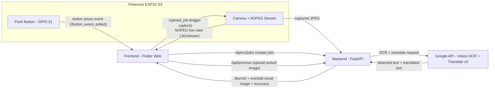

# Handheld OCR Translator

## 1. Introduction

Handheld OCR Translator is a camera-based tool that captures an image of printed text, detects and translates it, and renders the translated text back on top of the original image (with the source text blurred out). Its purpose is to provide real-time, on-device-triggered translation of signs, labels, and documents without manually retyping text into a translation app. The current prototype (`wireless_mvp/`) is built around a **Freenove ESP32-S3** camera board that streams live video and captures stills over Wi-Fi to a FastAPI backend, controlled from a Flutter frontend and/or a physical push button wired to the board.

## 2. Technologies Used

| Category | Technology |
|---|---|
| **APIs** | Google Cloud Vision API (`document_text_detection`, OCR) · Google Cloud Translation API v3 (`translate_text`) |
| **Backend** | Python · FastAPI · Uvicorn |
| **Frontend** | Flutter (Web, via `flutter run -d chrome`) · Dart |
| **Firmware** | C++ (Arduino framework) · PlatformIO · ESP-IDF camera/HTTP server (`esp_camera`, `esp_http_server`) |
| **Hardware** | Freenove ESP32-S3-WROOM camera board (`board = freenove_esp32_s3_wroom`), OV-series camera module (ESP32-S3-EYE profile), physical push button on GPIO 21 |
| **Libraries / Packages** | `google-cloud-vision`, `google-cloud-translate`, `opencv-python` (`cv2`), `numpy`, `Pillow` (`PIL`), `pydantic` (via FastAPI) — backend; `http`, `file_picker`, `shared_preferences` — frontend (see [pubspec.yaml](wireless_mvp/frontend/pubspec.yaml)) |

Legacy/earlier stages of the project (see [Section 5](#5-building-process)) also used **PaddleOCR**, **Tesseract**, and **Jetson.GPIO** — these remain in [laptop_mvp/](laptop_mvp/) but are not part of the current ESP32 prototype.

## 3. Functions and Features

- **Image capture**: Triggered three ways — the Flutter "Capture" button, the ESP32's physical push button (GPIO 21, debounced in firmware), or uploading an existing image file from disk. The ESP32 streams MJPEG live video (port 81, `/stream`) so the frontend always shows a live preview before capture.
- **Image processing**: The backend ([blur_and_overlay/processor.py](wireless_mvp/backend/blur_and_overlay/processor.py)) Gaussian-blurs each detected text region (`cv2.GaussianBlur`) to obscure the original text, then overlays the translated text, auto-fitting font size/line-wrapping to the region's bounding box and picking a script-appropriate font (Han/Kana/Hangul/Arabic/Devanagari or Latin) so non-Latin scripts render correctly instead of as "tofu" boxes.
- **OCR**: Google Cloud Vision's `document_text_detection` returns word-level polygons, text, and per-word confidence ([OCR/google_vision.py](wireless_mvp/backend/OCR/google_vision.py)). Adjacent words on the same line are merged into phrases ([gui/pipeline.py](wireless_mvp/backend/gui/pipeline.py)) before translation so phrases translate coherently rather than word-by-word.
- **Translation**: Google Cloud Translation API v3 translates the merged phrases in a single batched request ([translation/translator.py](wireless_mvp/backend/translation/translator.py)), with a `gcloud`-token REST fallback if the primary gRPC client call fails.
- **Communication between components**:
  - Frontend ↔ Backend: HTTP/multipart (`/api/languages`, `/api/process`, `/api/v1/jobs`) — see [services/backend_client.dart](wireless_mvp/frontend/lib/services/backend_client.dart).
  - Frontend ↔ ESP32: HTTP (`/button_event`, `/upload_job`) and MJPEG (`:81/stream`) — see [services/esp32_client.dart](wireless_mvp/frontend/lib/services/esp32_client.dart).
  - ESP32 → Backend: the ESP32 itself uploads the captured JPEG directly to the backend job endpoint (not routed through Flutter) — see [firmware/src/app_httpd.cpp](wireless_mvp/firmware/src/app_httpd.cpp).
- **Displayed OCR confidence score**: The "Accuracy" value shown in the UI is the **average per-word OCR confidence** reported by Google Vision for the captured image (not a measure of translation quality), computed in `TranslationPipeline.process()` and labeled "High/Medium/Low Confidence" in the UI based on thresholds (≥90%, ≥70%, below) — see `_confidenceLabel()` in [home_screen.dart](wireless_mvp/frontend/lib/screens/home_screen.dart).
- **User interface / GUI**: A single-screen Flutter app showing the live camera feed (or a frozen/result image), language pickers with a swap button, Capture/Upload/Translate/Retake pill buttons, an FPS badge, a Settings dialog for the Backend/ESP32 URLs (remembered per-browser via `shared_preferences`), and a live-FPS/eye-toggle to hide the HUD.

### Data flow



## 4. How to Use the Project

### Required software

- Python 3.9+ with the packages in [wireless_mvp/backend/requirements.txt](wireless_mvp/backend/requirements.txt)
- Flutter SDK ≥ 3.19 / Dart SDK ≥ 3.3 (see [pubspec.yaml](wireless_mvp/frontend/pubspec.yaml))
- [PlatformIO](https://platformio.org/) (for building/uploading the firmware)
- A Google Cloud project with the Vision and Translation APIs enabled, authenticated via Application Default Credentials (`gcloud auth application-default login`) or a `GOOGLE_APPLICATION_CREDENTIALS` service account key

### Install & run the backend

```powershell
cd wireless_mvp
pip install -r backend/requirements.txt
python -m uvicorn backend.main:app --host 0.0.0.0 --port 8000 --reload
```

`--host 0.0.0.0` is required so the ESP32 and the Flutter app can reach the backend over the LAN.

### Install & run the frontend

```powershell
cd wireless_mvp/frontend
flutter pub get
flutter run -d chrome
```

### Entering IP addresses in the frontend

Open the Settings dialog (gear icon, top-right) and fill in:

| Field | Value | Notes |
|---|---|---|
| Backend URL | This computer's LAN IP + port, e.g. `http://10.0.0.90:8000` | Never `localhost` — the ESP32 can't resolve that back to this machine |
| ESP32 camera URL | The ESP32's IP or mDNS name, e.g. `http://esp32cam.local` or `http://192.168.1.60` | |

Press **Apply**. Both values are saved to this browser's local storage ([home_screen.dart](wireless_mvp/frontend/lib/screens/home_screen.dart)) so they auto-fill on the next run of the app on the same machine; a brand-new machine still needs these entered once.

### Connecting the ESP32 to Wi-Fi

1. Copy [firmware/include/wifi_credentials.example.h](wireless_mvp/firmware/include/wifi_credentials.example.h) to `firmware/include/wifi_credentials.h` (gitignored) and fill in `WIFI_SSID`/`WIFI_PASSWORD`.
2. Build and upload with PlatformIO:
   ```powershell
   cd wireless_mvp/firmware
   platformio run --target upload
   ```
3. On boot, the ESP32 tries to join `WIFI_SSID` for up to 20 seconds. If that fails, it falls back to broadcasting its own access point (`AP_SSID`/`AP_PASSWORD`, default `"ESP32-Camera"` / `"camera123"`) that you can connect to directly — see [firmware/src/main.cpp](wireless_mvp/firmware/src/main.cpp).
4. The serial monitor (115200 baud) prints the resulting IP address to enter into the frontend's ESP32 camera URL field.

### How the hardware functions

- The camera (ESP32-S3-EYE sensor profile) streams MJPEG on port 81 and serves still captures / job uploads / button-event polling on port 80 ([app_httpd.cpp](wireless_mvp/firmware/src/app_httpd.cpp)).
- A physical push button is wired to GPIO 21 (`INPUT_PULLUP`, so the button should connect GPIO 21 to GND when pressed); firmware debounces it in software (50 ms) and exposes the press as `capture_requested` via `/button_event`, polled every 250 ms by the frontend.
- Circuit/wiring diagram: **[TODO — no schematic/wiring diagram file found in the repository]**.

### Operating the device

1. Start the backend and frontend as above, and power on the ESP32.
2. In the frontend, confirm the live view is streaming and both URLs are set.
3. Pick source/target languages (swap button available).
4. Capture via the **Capture** button, the physical push button, or **Upload Image** + **Translate** for an existing file.
5. While processing, the last frame freezes with a "Processing..." overlay.
6. The result image (blurred source text + translated overlay) displays along with the Accuracy and processing-time readout; press **Retake** to return to the live view.

## 5. Building Process

1. **`laptop_mvp`**: Started as a Tesseract/PaddleOCR OCR benchmarking tool evaluated against the ICDAR 2013 dataset (CER/WER metrics, see [laptop_mvp/evaluation.py](laptop_mvp/evaluation.py), [laptop_mvp/metrics.py](laptop_mvp/metrics.py)), then grew into a Tkinter desktop GUI ([laptop_mvp/gui/app.py](laptop_mvp/gui/app.py)) that captured frames from a webcam, ran PaddleOCR, and used the Google Cloud Translation API with a blur/overlay rendering step.
2. **Migration to Jetson Orin Nano**: `laptop_mvp/requirements.txt`'s conditional `Jetson.GPIO` dependency and [laptop_mvp/OCR/paddle_ocr.py](laptop_mvp/OCR/paddle_ocr.py)'s GPU/CUDA device resolution (`_resolve_paddle_device()`) indicate the pipeline was run on a Jetson Orin Nano to get GPU-accelerated PaddleOCR inference. **[TODO — no dedicated doc describing this stage in detail beyond what the code implies]**.
3. **Push-button implementation**: [laptop_mvp/gpio_button.py](laptop_mvp/gpio_button.py) added a `GpioCaptureTrigger` that polls a Jetson GPIO pin (rather than using interrupt-based `add_event_detect()`, which was unreliable on some JetPack/kernel combinations) to trigger capture from a physical button, mirrored by the frontend's "dual function" button (git history: `push button dual function`).
4. **Migration to ESP32 (`wireless_mvp`)**: The project moved off the Jetson entirely onto a Freenove ESP32-S3 camera board for a fully wireless, handheld form factor. Since the ESP32 cannot run PaddleOCR locally, OCR moved from PaddleOCR to the cloud-based **Google Cloud Vision API** (git history: `edit wireless_mvp, replace Paddle with Google vision`), and the GUI moved from Tkinter to a Flutter frontend talking to a new FastAPI backend over Wi-Fi, with the push button re-implemented in ESP32 firmware (GPIO 21) instead of Jetson GPIO.

## 6. Personal Learnings & Challenges

- **Image processing methods**: Getting the blur-and-overlay step to look right took more iteration than I expected — fitting translated text into the original text's bounding box while keeping it readable required dynamically scaling font size and line-wrapping rather than using a fixed font. I also learned the hard way that Pillow silently renders unsupported glyphs as blank boxes, so font selection has to be driven by actually detecting the script of the text, not just the declared language code.
- **OCR**: Moving from a locally-run model (PaddleOCR on CPU/Jetson GPU) to a cloud OCR API (Google Vision) simplified the embedded side enormously but introduced new considerations, like handling network latency/variance and designing a fallback path for when the primary API call fails.
- **User interface development**: Building the UI twice — once in Tkinter for the laptop/Jetson prototype and once in Flutter for the wireless version — taught me how much state management (live view vs. frozen vs. result vs. picked-image) matters for a camera-driven app, and how useful it is to keep both frontends' layout/behavior conceptually mirrored to simplify the rewrite.
- **Soldering/electronics**: Wiring a physical push button to a microcontroller GPIO pin and getting reliable debounced input (first on Jetson, later on the ESP32) was a good reminder that small hardware details — pull-up resistors, debounce timing, which GPIO is safe to use at boot — can cause problems that look like software bugs at first.

## 7. Future Improvements

Current implementation: cloud OCR/translation via Google APIs, Wi-Fi-based ESP32 camera with MJPEG streaming, Flutter web frontend, FastAPI backend, physical and on-screen capture triggers.

Potential future improvements:

- Proper right-to-left shaping/reshaping for Arabic text overlay (currently rendered without `arabic-reshaper`/`python-bidi`, so joined letterforms are not shaped).
- Automatic discovery of the backend/ESP32 addresses (e.g. mDNS-based discovery) instead of manually entering IPs, beyond the current per-browser remembered-URL behavior.
- A packaged/compiled desktop or mobile build of the Flutter frontend instead of `flutter run -d chrome` for end users.
- Offline/on-device OCR fallback for when the ESP32 has no internet access to reach Google APIs.
- Consolidating/removing the unused legacy `laptop_mvp`-derived code paths that are no longer part of the active ESP32 prototype.
